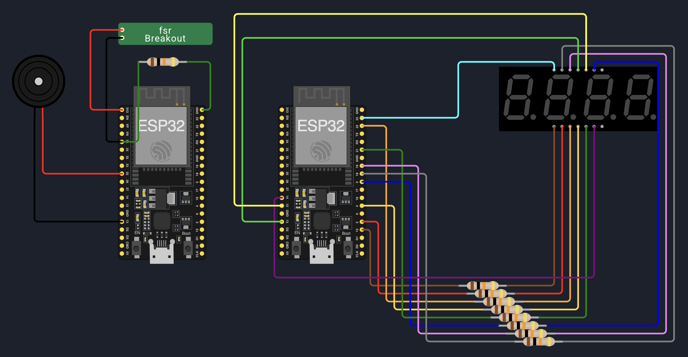

# 🪑 Fess Time – Dispositif IoT de Monitoring d’Assise

## 📌 Présentation

**Fess Time** est un projet IoT mêlant électronique embarquée, ergonomie et analyse comportementale.  
Il permet de mesurer le temps passé assis sur une chaise équipée, afin de déclencher des actions :
- alertes sonores,
- notifications,
- voire stimuli physiques (vibration, électrostimulation...).

Ce projet combine :
- ESP32 et capteur de pression FSR,
- communication MQTT avec TLS,
- bridge vers HiveMQ Cloud,
- une application web temps réel pour visualiser les données.

---

## 🏗️ Architecture technique

Capteur FSR → ESP32 → Mosquitto local → HiveMQ Cloud → Application Web (MQTT.js)

- Protocoles utilisés : `MQTT`, `TLS v1.2`, `WebSocket`, `HTTP`
- Topic principal : `sensor/fsr`

---

## 🧰 Matériel nécessaire

### Partie capteur

- ESP32 (avec MicroPython)
- Capteur de pression FSR
- Haut-parleur (optionnel)
- Afficheur (optionnel)
- Breadboard, câblage, alimentation 5V

### Partie passerelle

- Raspberry Pi ou PC sous Linux/WSL
- Mosquitto
- Accès Internet
- Certificats TLS

### Schéma de câblage


| **Composant**                 | **Port ESP32** |
|-------------------------------|----------------|
| Afficheur 7 segments          | 23      |
| Afficheur 7 segments          | 18      |
| Afficheur 7 segments          | 19      |
| Afficheur 7 segments          | 13      |
| Afficheur 7 segments          | 12      |
| Afficheur 7 segments          | 5       |
| Afficheur 7 segments          | 15      | + resistance
| Afficheur 7 segments          | 2       | + resistance
| Afficheur 7 segments          | 22      | + resistance
| Afficheur 7 segments          | 4       | + resistance
| Afficheur 7 segments          | 21      | + resistance
| Afficheur 7 segments          | 14      | + resistance
| Force Sensor Resistence (FSR) | 3v3             |
| Force Sensor Resistence (FSR) | 34              | + resistance -> GND
| Haut-parleur                  | 25              |
| Haut-parleur                  | GND             |
---

## 🚀 Démarrage rapide

```bash
# Cloner le projet
git clone https://github.com/MinaelTrumacher/fess-time.git
cd fess-time

# Lancer l'installation Mosquitto + bridge (nécessite sudo)
./config/setup_mosquitto_bridge.sh
```

## ⚙️ Installation & Configuration

### 1. Cloner le projet

```bash
git clone https://github.com/MinaelTrumacher/fess-time.git
cd fess-time
``` 

### 2. Installer Mosquitto et configurer le bridge HiveMQ
Un script est fourni pour :

- installer Mosquitto,

- créer les fichiers de configuration,

- télécharger le certificat TLS,

- redémarrer le service.

- [scriptBash](./config/setup_mosquitto_bridge.sh)

### 3. Déployer le code sur l’ESP32
- Flasher MicroPython sur l’ESP32 si nécessaire.

- Uploader le code contenu dans le dossier esp32/ :

- lecture analogique du capteur,

- détection d’assise (valeur ≥ 0),

- envoi régulier via MQTT (sensor/fsr),

- déclenchement sonore et timer.

### 4. Interface Web
L’application Web se connecte à HiveMQ via MQTT.js en WebSocket.

Fonctionnalités :

- affichage en direct si une personne est assise,

- état assis/debout,

- timer de session,

- alertes visuelles ou sonores.

### 📡 Données transmises
- Topic : sensor/fsr
- Payload : valeur entière (ex: 234, 9999)
- Seuil : toute valeur > 0 signifie que l'utilisateur est assis.

### 🛠️ Suivi et Débogage

``` 
# Afficher les logs en direct
sudo journalctl -u mosquitto -f
```

### 🧪 Améliorations futures
- Statistiques d’assise

- Historique par jour / semaine

- Détection multi-utilisateur

- Actionneurs physiques intégrés

- Mode jeu ou pause obligatoire

---


